# Introduction to Configuration Management in Kubernetes with Kustomize on AWS

> GitHub Repo: https://github.com/Techytobii/kubernetes-with-kustomize.git


## Table of Contents
1. [Overview](#1-overview)  
2. [Objectives](#2-objectives)  
3. [Prerequisites](#4-prerequisites)  
4. [Install & Configure Tools](#5-install--configure-tools)  
5. [Project Structure](#6-project-structure)  
6. [Step-by-Step Execution](#7-step-by-step-execution)  
7. [CI/CD Pipeline Testing](#8-cicd-pipeline-testing)  
8. [Verification & Access](#9-verification--access)  
9. [Cleanup](#10-cleanup)  
10. [Challenges Faced](#11-challenges-faced)  
11. [Troubleshooting](#12-troubleshooting)  
12. [References](#13-references)  

---

## 1. Overview
This mini-project introduces **configuration management** in Kubernetes using **Kustomize** on **Amazon EKS**. You will install required tools, create an EKS cluster, deploy a sample app using **base + overlays**, and validate updates via a simple CI/CD-style workflow.

---

## 2. Objectives
1. Understand how **Kustomize** manages environment-specific configuration without duplicating YAML.
2. Provision a managed Kubernetes cluster on **AWS EKS** using `eksctl`.
3. Deploy a sample workload with **dev** and **prod** overlays.
4. Demonstrate change management by modifying an overlay and pushing via Git.
5. Clean up resources to avoid unnecessary cost.

---

## 3. Architecture & Concepts
- **Base**: Shared manifests (Deployment, Service).
- **Overlays**: Environment-specific patches (e.g., replica counts, labels, service type).
- **EKS**: Managed Kubernetes control plane on AWS.
- **kubectl**: CLI to interact with the cluster.
- **eksctl**: CLI to create/manage EKS clusters.

Kustomize Concept (Base -> Overlays)
```
myapp/
├── base
│ ├── deployment.yaml
│ ├── service.yaml
│ └── kustomization.yaml
└── overlays
├── dev
│ ├── kustomization.yaml
│ └── replica-patch.yaml
└── prod
├── kustomization.yaml
└── replica-patch.yaml
```

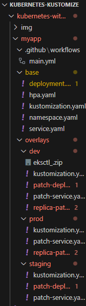

---

## 4. Prerequisites
- AWS account with permissions for EKS, EC2, VPC, IAM.
- Local machine with admin rights (to install CLIs).
- A GitHub repository (e.g., this project):  
  https://github.com/Techytobii/kubernetes-with-kustomize.git

> **Cost Note:** EKS and worker nodes incur costs while running. Always complete the [Cleanup](#10-cleanup).

---

## 5. Install & Configure Tools

### 5.1 AWS CLI
```bash
# Linux
curl "https://awscli.amazonaws.com/awscli-exe-linux-x86_64.zip" -o awscliv2.zip
unzip awscliv2.zip
sudo ./aws/install
```
```
aws --version
aws configure
# Provide: Access Key, Secret, Region (e.g., us-east-1), Output: json
```

### 5.2 eksctl

```
bash
Copy
Edit
curl --silent --location \
"https://github.com/eksctl-io/eksctl/releases/latest/download/eksctl_$(uname -s)_amd64.tar.gz" \
| tar xz -C /tmp
sudo mv /tmp/eksctl /usr/local/bin
eksctl version
```

### 5.3 kubectl

```
bash
Copy
Edit
curl -LO "https://dl.k8s.io/release/$(curl -Ls https://dl.k8s.io/release/stable.txt)/bin/linux/amd64/kubectl"
chmod +x kubectl
sudo mv kubectl /usr/local/bin
kubectl version --client
```

### 5.4 Kustomize

```
bash
Copy
Edit
curl -s "https://raw.githubusercontent.com/kubernetes-sigs/kustomize/master/hack/install_kustomize.sh" | bash
sudo mv kustomize /usr/local/bin
kustomize version
```

## 6. Project Structure
Create a working directory and use the following structure (you can also clone the repo and adjust as needed):
```
bash
Copy
Edit
mkdir -p kubernetes-with-kustomize && cd kubernetes-with-kustomize
mkdir -p k8s/base k8s/overlays/dev k8s/overlays/prod images
Base manifests (k8s/base)
```

# myapp/base/deployment.yaml
```
apiVersion: apps/v1
kind: Deployment
metadata:
  name: nginx-deployment
spec:
  replicas: 2
  selector:
    matchLabels:
      app: nginx
  template:
    metadata:
      labels:
        app: nginx
    spec:
      containers:
      - name: nginx
        image: nginx:1.25
        ports:
        - containerPort: 80

```

# myapp/base/service.yaml
```
apiVersion: v1
kind: Service
metadata:
  name: nginx-service
spec:
  selector:
    app: nginx
  ports:
    - port: 80
      targetPort: 80
```
# myapp/base/kustomization.yaml
```
resources:
  - deployment.yaml
  - service.yaml
Overlays (k8s/overlays/dev)
```

# myapp/overlays/dev/kustomization.yaml
```
bases:
  - ../../base
namePrefix: dev-
commonLabels:
  environment: dev
patchesStrategicMerge:
  - replica-patch.yaml
  - service-patch.yaml
  ```

# myapp/overlays/dev/replica-patch.yaml
```
apiVersion: apps/v1
kind: Deployment
metadata:
  name: nginx-deployment
spec:
  replicas: 1
  ```
# myapp/overlays/dev/service-patch.yaml
```
apiVersion: v1
kind: Service
metadata:
  name: nginx-service
spec:
  type: LoadBalancer
Overlays (k8s/overlays/prod)
```

# myapp/overlays/prod/kustomization.yaml
```
bases:
  - ../../base
namePrefix: prod-
commonLabels:
  environment: prod
patchesStrategicMerge:
  - replica-patch.yaml
  - service-patch.yaml
  ```

# myapp/overlays/prod/replica-patch.yaml
```
apiVersion: apps/v1
kind: Deployment
metadata:
  name: nginx-deployment
spec:
  replicas: 4
  ```

# myapp/overlays/prod/service-patch.yaml

```
apiVersion: v1
kind: Service
metadata:
  name: nginx-service
spec:
  type: LoadBalancer
  ```

## 7. Step-by-Step Execution

### 7.1 Create an EKS Cluster
```
eksctl create cluster \
  --name kustomize-demo-cluster \
  --version 1.29 \
  --region us-east-1 \
  --nodegroup-name demo-nodes \
  --node-type t3.medium \
  --nodes 2 \
  --nodes-min 1 \
  --nodes-max 3 \
  --managed
  ```
If needed, refresh kubeconfig explicitly:

* aws eks update-kubeconfig --profile terraform-needs-891377184590 --name kustomize-demo-cluster --region us-east-1

### 7.2 Verify Cluster Access
```
kubectl cluster-info
kubectl get nodes -o wide
kubectl config get-contexts
```

### 7.3 Deploy Dev Overlay
```
kubectl apply -k k8s/overlays/dev
kubectl rollout status deployment/dev-nginx-deployment
kubectl get svc
```

### 7.4 Deploy Prod Overlay
```
kubectl apply -k k8s/overlays/prod
kubectl rollout status deployment/prod-nginx-deployment
kubectl get svc
```

## 8. CI/CD Pipeline Testing
* Goal: Validate that committing a configuration change (e.g., replica count) triggers an automated deployment in your CI/CD platform.

### 8.1 Make a Configuration Change
* Edit the dev overlay to change replicas (example: 1 → 3):
``
sed -i 's/replicas: 1/replicas: 3/' k8s/overlays/dev/replica-patch.yaml
``
### 8.2 Commit & Push Changes

```
git init
git remote add origin https://github.com/Techytobii/kubernetes-with-kustomize.git
git add .
git commit -m "feat(dev): update replicas to 3 via Kustomize overlay"
git branch -M main
git push -u origin main
```

>> Note: Ensure your CI/CD runner has access to the cluster (kubeconfig or IAM role).
For GitHub Actions, consider a workflow that uses:

* aws-actions/configure-aws-credentials

* aws eks update-kubeconfig

8 kubectl apply -k k8s/overlays/dev

### Example GitHub Actions snippet:

### .github/workflows/main.yaml

```
name: Deploy Dev (Kustomize)
on:
  push:
    paths:
      - "k8s/**"
    branches: [ "main" ]

jobs:
  deploy:
    runs-on: ubuntu-latest
    permissions:
      id-token: write
      contents: read
    steps:
      - uses: actions/checkout@v4
      - uses: aws-actions/configure-aws-credentials@v4
        with:
          aws-region: us-east-1
          role-to-assume: arn:aws:iam::<ACCOUNT_ID>:role/<GITHUB_OIDC_ROLE>
      - name: Update kubeconfig
        run: aws eks update-kubeconfig --name kustomize-demo-cluster --region us-east-1
      - name: Apply Kustomize (dev)
        run: kubectl apply -k k8s/overlays/dev
```

## 9. Verification & Access
### 9.1 Check Workloads
```
kubectl get deployments -A
kubectl get pods -A
kubectl get svc -A
```

### 9.2 Access the App

* If Service type is LoadBalancer, fetch the external address:
```
kubectl get svc dev-nginx-service -o jsonpath='{.status.loadBalancer.ingress[0].hostname}{"\n"}'
kubectl get svc prod-nginx-service -o jsonpath='{.status.loadBalancer.ingress[0].hostname}{"\n"}'
```
Open the hostname(s) in a browser.

Alternatively, port-forward (useful for private clusters):

kubectl port-forward svc/dev-nginx-service 8080:80
# Visit http://localhost:8080

## 10. Cleanup
Remove all resources to stop incurring costs:

### Remove dev/prod resources (optional, eksctl will delete nodegroup anyway)
kubectl delete -k k8s/overlays/dev || true
kubectl delete -k k8s/overlays/prod || true

### Delete the EKS cluster
eksctl delete cluster --name kustomize-demo-cluster --region us-east-1

## 11. Challenges Faced

* Cluster Version Mismatch
Older Kubernetes versions are not supported by EKS; ensure --version is a currently supported EKS version (e.g., 1.29 at the time of writing).

* kubectl Connection Errors
Context pointed to a local cluster (e.g., 127.0.0.1). Fix by updating kubeconfig:
aws eks update-kubeconfig --name kustomize-demo-cluster --region us-east-1

* IAM/Authentication Issues
Misconfigured AWS profiles or missing permissions block cluster creation. Verify with aws sts get-caller-identity and use a role/user with EKS privileges.

* LoadBalancer Pending
External IP/hostname may remain pending without a proper public subnet or IAM permissions for the load balancer controller. Use public subnets in the EKS node group, or port-forward as a fallback.

* Slow Rollouts / Stuck Pods
Often due to image pull errors or security groups. Check:
kubectl describe pod <pod> and node SG rules for egress.


12. Troubleshooting
See Current Context
```
kubectl config current-context
kubectl config get-contexts
Repoint Context to EKS
```
* aws eks update-kubeconfig --name kustomize-demo-cluster --region us-east-1
>> Check IAM Identity

* aws sts get-caller-identity


>> Health & Events
```
kubectl get events -A --sort-by=.lastTimestamp
kubectl describe deployment dev-nginx-deployment
DNS/Networking

Ensure nodes are in subnets with Internet access if using public LoadBalancers.

Confirm security group rules allow required traffic (HTTP 80, egress 0.0.0.0/0 for testing).
```

## 13. References
* Kustomize: https://kubectl.docs.kubernetes.io/guides/introduction/kustomize/

* AWS EKS User Guide: https://docs.aws.amazon.com/eks/latest/userguide/what-is-eks.html

* eksctl: https://eksctl.io/

* kubectl: https://kubernetes.io/docs/reference/kubectl/

### Imgages Placeholder

* images


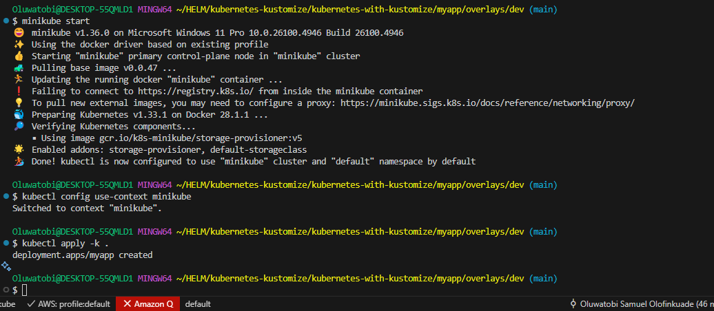

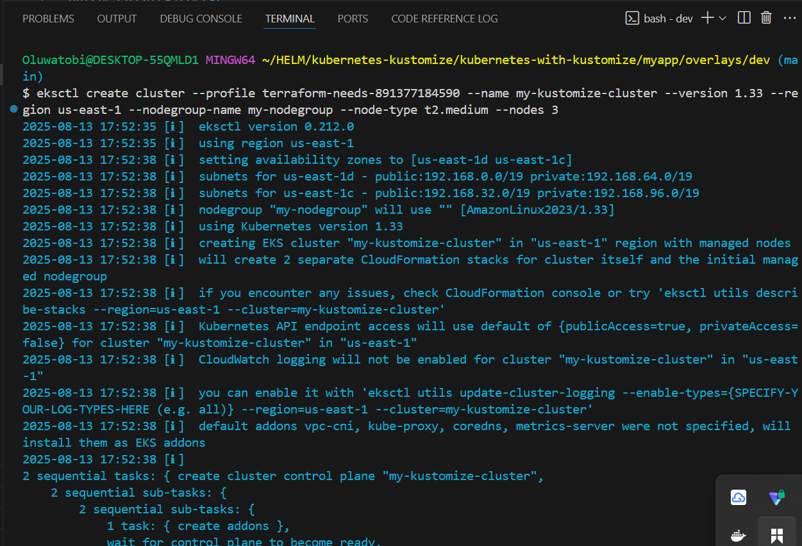

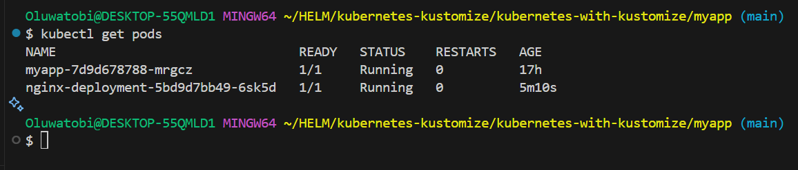

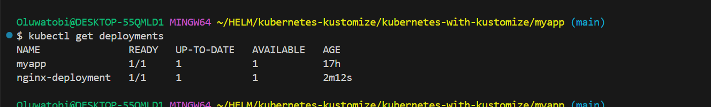

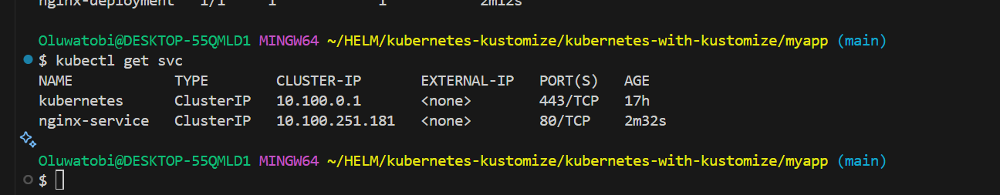

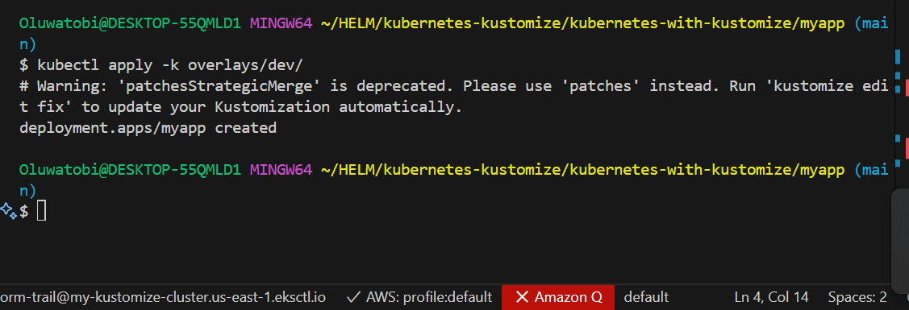

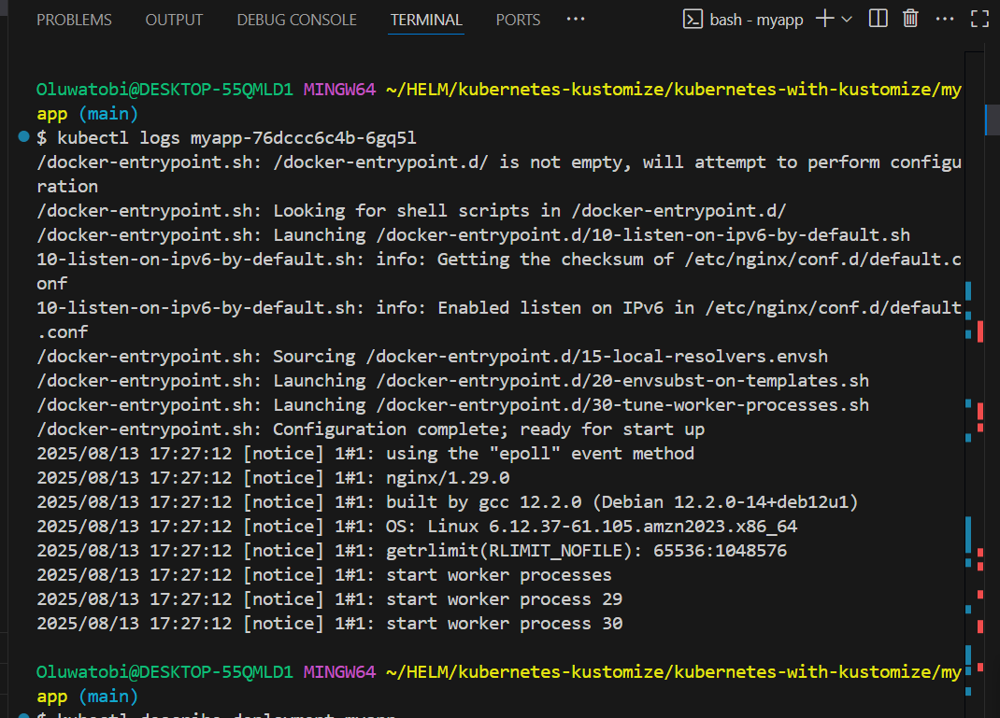

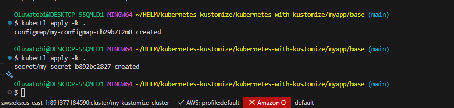

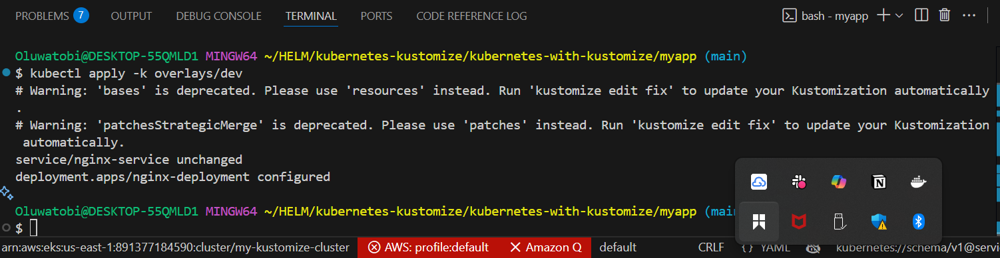

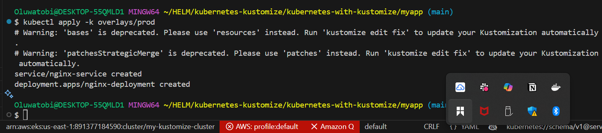

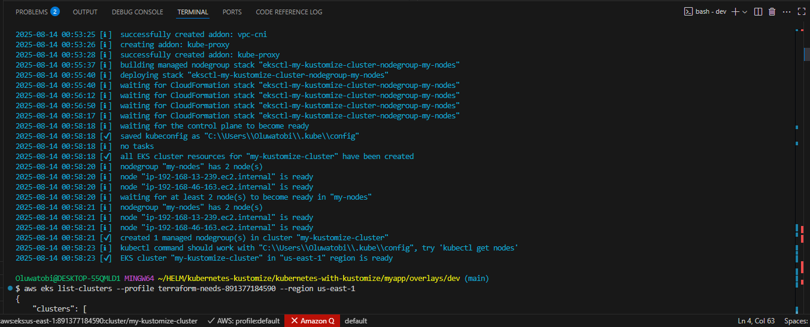

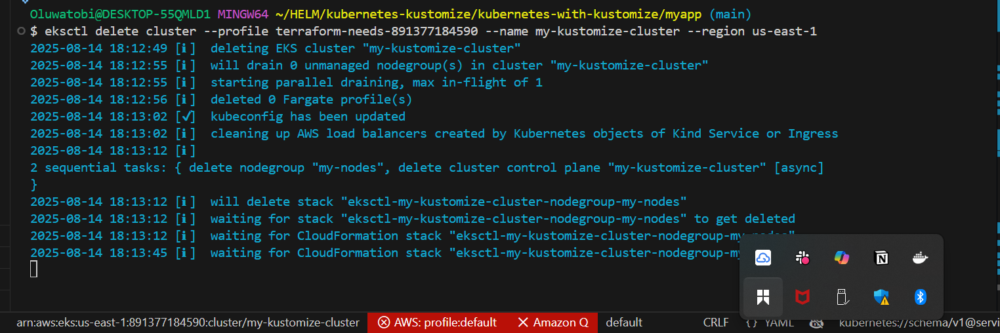


* Contributing
PRs and issues welcome at: https://github.com/Techytobii/kubernetes-with-kustomize.git