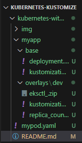
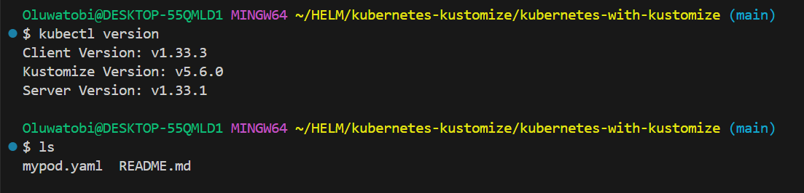
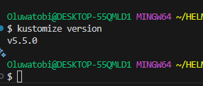
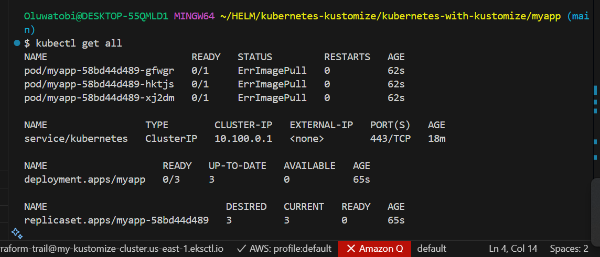
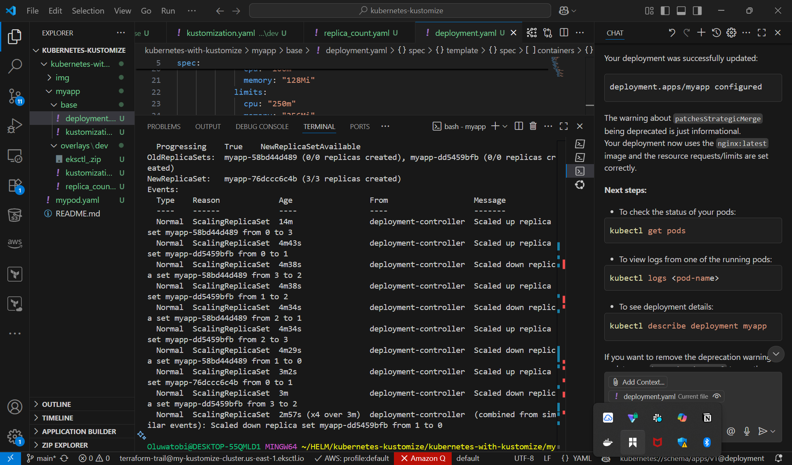
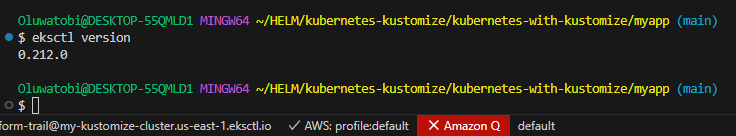
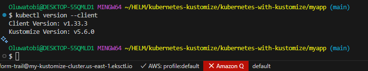

# Introduction to Configuration Management in Kubernetes with Kustomize on AWS

## 1. Overview
This project introduces **configuration management** in Kubernetes using **Kustomize**, a Kubernetes-native tool for customizing resource configurations without modifying the original YAML files.  

You will:
- Learn the basics of Kubernetes configuration management
- Install and configure required tools (`kubectl`, `kustomize`, `eksctl`, AWS CLI)
- Provision an **Amazon EKS** cluster
- Deploy resources to different environments using Kustomize overlays
- Clean up resources to avoid unnecessary AWS costs

---

## 2. Objectives
The main objectives of this project are:
1. **Understand Kubernetes Configuration Management** – Learn how to manage YAML configurations effectively across multiple environments.
2. **Hands-on Kustomize** – Use Kustomize to apply overlays and customize Kubernetes manifests without duplicating files.
3. **AWS EKS Deployment** – Provision a Kubernetes cluster on AWS using `eksctl`.
4. **Environment-Specific Deployments** – Demonstrate how to deploy to `dev` and `prod` environments using different overlays.
5. **Resource Cleanup** – Properly remove deployments and delete the EKS cluster to avoid AWS costs.

---

## 3. Understanding Configuration Management in Kubernetes
In Kubernetes, **configuration management** ensures consistent and repeatable deployment of resources across different environments (development, staging, production).  

**Kustomize** enables:
- Overlays for environment-specific customization
- Reusable base configurations
- Separation of concerns between shared and environment-specific settings



---

## 4. Prerequisites
- AWS account with IAM permissions for EKS
- AWS CLI configured with your credentials
- Installed versions of:
  - **kubectl**
  - **kustomize**
  - **eksctl**
  - Git for managing commits

---

## 5. Installation Steps

### 5.1 Install AWS CLI
```bash
# Linux
curl "https://awscli.amazonaws.com/awscli-exe-linux-x86_64.zip" -o "awscliv2.zip"
unzip awscliv2.zip
sudo ./aws/install

# Windows (PowerShell)
msiexec.exe /i https://awscli.amazonaws.com/AWSCLIV2.msi
Verify:

bash
Copy
Edit
aws --version
```

### 5.2 Install kubectl
```
bash
Copy
Edit
# Linux
curl -o kubectl https://amazon-eks.s3.us-west-2.amazonaws.com/latest/bin/linux/amd64/kubectl
chmod +x ./kubectl
sudo mv kubectl /usr/local/bin/

# Windows
curl -o kubectl.exe https://amazon-eks.s3.us-west-2.amazonaws.com/latest/bin/windows/amd64/kubectl.exe
Verify:

bash
Copy
Edit
kubectl version --client
```

### 5.3 Install eksctl
```
bash
Copy
Edit
# Linux
curl --location "https://github.com/weaveworks/eksctl/releases/latest/download/eksctl_$(uname -s)_amd64.tar.gz" | tar xz
sudo mv eksctl /usr/local/bin

# Windows
choco install eksctl
Verify:

bash
Copy
Edit
eksctl version
```

### 5.4 Install Kustomize
```
bash
Copy
Edit
# Linux & Mac
curl -s "https://raw.githubusercontent.com/kubernetes-sigs/kustomize/master/hack/install_kustomize.sh" | bash
sudo mv kustomize /usr/local/bin

# Windows
choco install kustomize
Verify:

bash
Copy
Edit
kustomize version
```

## 6. Create an EKS Cluster
```
bash
Copy
Edit
eksctl create cluster \
  --profile terraform-needs-891377184590 kustomize-demo-cluster \
  --version 1.28 \
  --region us-east-1 \
  --nodegroup-name demo-node-group \
  --node-type t2.medium \
  --nodes 3
  ```


## 7. Configure Kubernetes Resources with Kustomize
### 7.1 Create Base Manifests
* Example structure:
```
csharp
Copy
Edit
k8s/
  base/
    deployment.yaml
    service.yaml
    kustomization.yaml
deployment.yaml:

yaml
Copy
Edit
apiVersion: apps/v1
kind: Deployment
metadata:
  name: my-app
spec:
  replicas: 2
  selector:
    matchLabels:
      app: my-app
  template:
    metadata:
      labels:
        app: my-app
    spec:
      containers:
      - name: my-app
        image: nginx:latest
        ports:
        - containerPort: 80
kustomization.yaml:

yaml
Copy
Edit
resources:
- deployment.yaml
- service.yaml
7.2 Create Environment Overlays
Example:

markdown
Copy
Edit
k8s/
  overlays/
    dev/
      kustomization.yaml
    prod/
      kustomization.yaml
overlays/dev/kustomization.yaml:

yaml
Copy
Edit
bases:
- ../../base
namePrefix: dev-
commonLabels:
  environment: dev
7.3 Deploy to EKS
bash
Copy
Edit
kubectl apply -k overlays/dev/
```


### 8. Cleanup
```
bash
Copy
Edit
```
### Delete resources

* kubectl delete -k overlays/dev/

### Delete the EKS cluster

* $ eksctl delete cluster --profile terraform-needs-891377184590 --name my-kustomize-cluster

### 9. Challenges Faced
During the project, the following challenges were encountered:

* Tool Version Mismatches – Some versions of eksctl and Kubernetes were not compatible, requiring version updates.

* kubectl Connection Errors – Initially faced issues with kubectl connecting to the cluster due to missing kubeconfig setup.

* AWS CLI Profile Misconfiguration – Incorrect AWS CLI profile settings caused authentication errors.

* Cluster Deletion Delays – EKS cluster deletion took longer than expected due to AWS resource dependencies.

* Networking Configuration – Security group and VPC settings needed adjustments to allow application traffic.

### 10. Additional Considerations
AWS Costs: EKS charges for running clusters; deleted unused clusters.

Security Practices: Use IAM roles, configure security groups, avoided hardcoding credentials.

Documentation Reference:

Kustomize Documentation

AWS EKS User Guide

### 11. Additional Images 
* Kubectl version



* Kustomize version 



* Myapp Created 


* Ekctl Cluster 


* Kubectl Get all



* KUBECTL Describe



* Kubectl Logs


* EKsctl Version



* Kubectl Version --client

